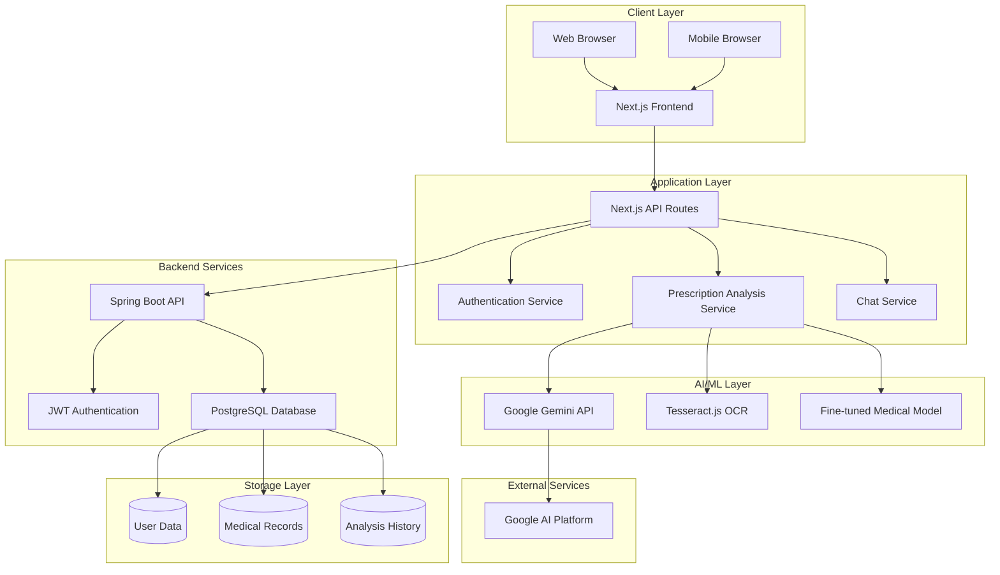
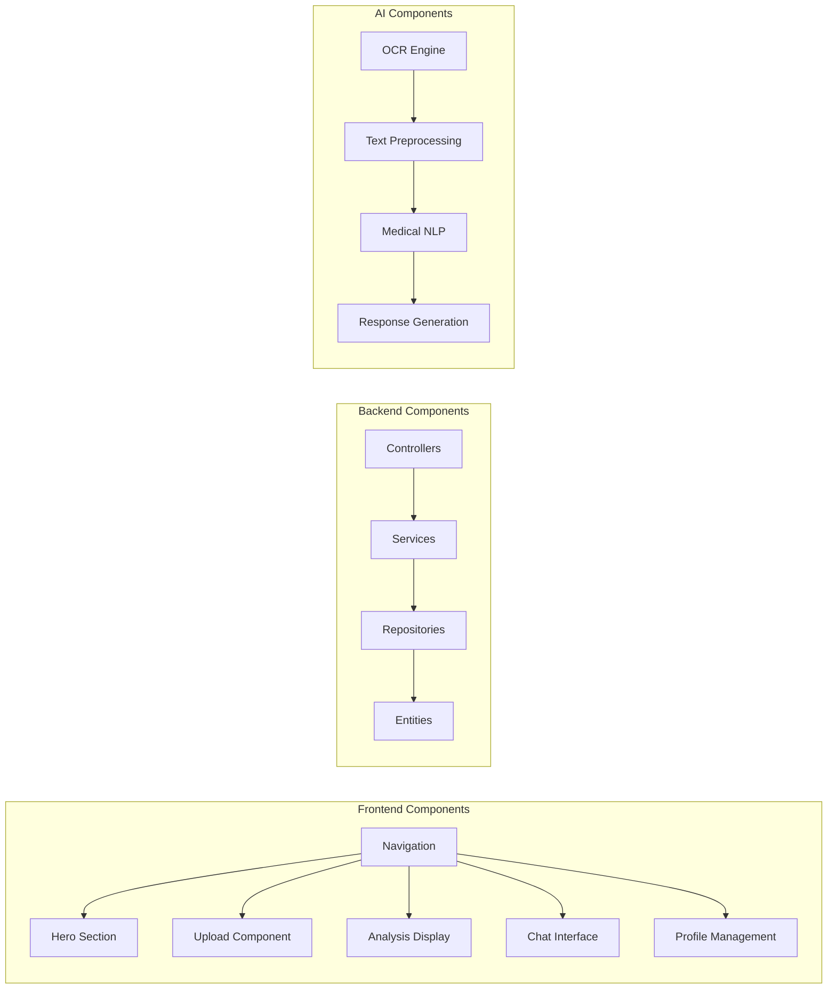
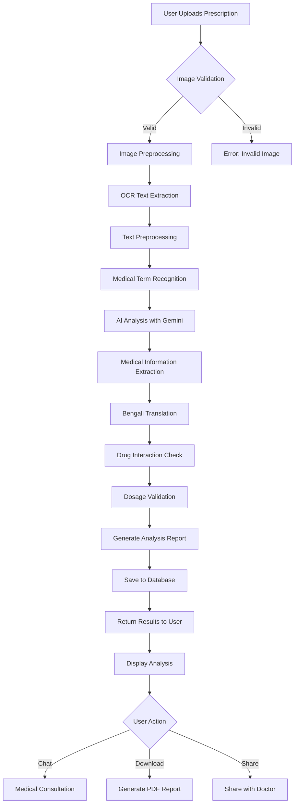
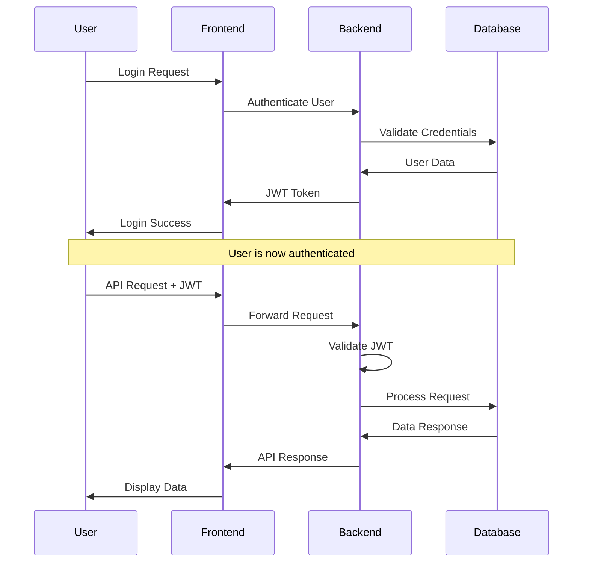

```mermaid
flowchart LR
    subgraph "Input Processing"
        A[Image Upload] --> B[Quality Check]
        B --> C[Format Validation]
        C --> D[Size Optimization]
    end
    
    subgraph "OCR Processing"
        D --> E[Noise Reduction]
        E --> F[Text Extraction]
        F --> G[Character Recognition]
        G --> H[Text Cleaning]
    end
    
    subgraph "AI Analysis"
        H --> I[Medical Term Detection]
        I --> J[Context Analysis]
        J --> K[Gemini AI Processing]
        K --> L[Medical Interpretation]
    end
    
    subgraph "Output Generation"
        L --> M[Bengali Translation]
        M --> N[Drug Information]
        N --> O[Interaction Warnings]
        O --> P[Final Report]
    end
```

# 🏥 PrescribeCorrect - AI-Powered Medical Prescription Analysis Platform

## 🎯 Project Overview

As we all know that doctors have illegible handwriting and it is difficult for individuals from non-medical background to understand the disease and the medicines mentioned in the report. Most of the times, even pharmacists find it difficult to decipher the handwriting written in medical reports. This is the problem we have been observing from decades and many have suffered due to this problem. In the modern era, few doctors have started to provide digitized prescriptions to maintain records, but most doctors still provide traditionally handwritten prescriptions on their printed letterhead. This is one of the main reasons we want to work on this problem.

Moreover, it is difficult to store and access physical documents in an efficient manner, search through them efficiently and to share them with others. Thus, a lot of important data gets lost or does not get reviewed because documents(prescription) never get transferred to digital format. This is another reason for us to work on this problem.

There are many existing models which convert handwritten images to digital text, but our aim is to go an extra mile and identify the keywords or medical terms from the prescriptions such as the disease, medicines prescribed, medical tests suggested, etc.

### 🌟 Key Highlights

- **✍️ Advanced Handwritten Text Recognition (HTR)**: Custom fine-tuned HTR model trained on real prescription samples to accurately decode handwritten prescription
- **🤖 AI-Powered Analysis**: Fine-tuned Google Gemini model on 2 lakh conversation data
- **🌏 Bilingual Support**: Complete English and Bengali language integration
- **📱 Multi-Platform**: Responsive web application with mobile-first design
- **🔒 Secure & Compliant**: HIPAA-compliant security measures and data protection
- **⚡ Real-time Processing**: Instant prescription analysis and medical consultations
- **👨‍⚕️ Healthcare Professional Portal**: Dedicated interfaces for doctors and medical staff

---

## 📋 Software Requirements Specification (SRS)

### 🎯 Purpose

MediBot to bridge the communication gap between healthcare providers and patients in Bangladesh by providing:
- Accurate prescription decoding
- Intelligent patient question answering (Fine-tune with dataset)
- AI-powered health consultations
- Comprehensive medical record management

### 🔍 Scope

#### Functional Requirements

##### 🏥 Core Medical Features
- **FR-001**: Prescription Image Upload and Processing
- **FR-002**: Advanced OCR with Medical Text Recognition
- **FR-003**: AI-Powered Medical Analysis and Interpretation
- **FR-004**: Bengali-English Medical Translation
- **FR-005**: Drug Interaction and Allergy Checking
- **FR-006**: Medical Consultation Chat System
- **FR-007**: Analysis History and Report Generation

##### 👤 User Management
- **FR-008**: Multi-role Authentication (Patient, Doctor, Admin)
- **FR-009**: User Profile Management
- **FR-010**: Doctor Verification and Approval System
- **FR-011**: Patient Medical History Tracking

##### 📊 Administrative Features
- **FR-012**: Admin Dashboard with Analytics
- **FR-013**: User Activity Monitoring
- **FR-014**: System Performance Metrics
- **FR-015**: Data Export and Reporting

#### Non-Functional Requirements

##### 🚀 Performance
- **NFR-001**: Response time < 3 minutes for prescription analysis
- **NFR-002**: Support for 100+ concurrent users
- **NFR-003**: 99.9% uptime availability
- **NFR-004**: Mobile responsiveness across all devices

##### 🔒 Security
- **NFR-005**: HTTPS encryption for all communications
- **NFR-006**: JWT-based authentication with refresh tokens
- **NFR-007**: Role-based access control (RBAC)
- **NFR-008**: HIPAA-compliant data handling

##### 🌐 Compatibility
- **NFR-009**: Cross-browser compatibility (Chrome, Firefox, Safari, Edge)
- **NFR-010**: Mobile device compatibility (iOS, Android)
- **NFR-011**: API versioning for backward compatibility

---

## 🏗️ System Architecture

### 🏛️ High-Level Architecture



### 🔧 Component Architecture



---

## 🚀 Features

### 🏥 Medical Analysis Features

#### 📄 Advanced Prescription Analysis
- **Smart OCR**: Enhanced image preprocessing with noise reduction
- **Medical Text Recognition**: Specialized recognition for medical handwriting
- **Drug Information**: Comprehensive drug database with Bengali translations
- **Dosage Interpretation**: Intelligent parsing of dosage instructions
- **Interaction Warnings**: Real-time drug interaction checking

#### 🩺 Health Consultation
- **AI Medical Chat**: 24/7 medical consultation chatbot
- **Symptom Analysis**: Intelligent symptom checker with recommendations
- **Health Tips**: Personalized health recommendations
- **Bengali Support**: Complete consultation in Bengali language

### � User Management Features

#### 🔐 Authentication & Authorization
- **Multi-Role System**: Patient, Doctor, Admin roles
- **Secure Login**: JWT-based authentication with Spring Security
- **Profile Management**: Comprehensive user profile system
- **Doctor Verification**: Medical license verification system

#### 📊 Data Management
- **Analysis History**: Complete history of all prescription analyses
- **Medical Records**: Secure storage of patient medical information
- **Report Generation**: PDF report generation for medical analyses
- **Data Export**: Export functionality for personal health records

### 📱 User Interface Features

#### 🎨 Modern Design
- **Responsive Design**: Mobile-first responsive interface
- **Dark/Light Mode**: Theme switching capability
- **Accessibility**: WCAG 2.1 AA compliant design
- **Bengali Typography**: Proper Bengali font rendering

#### ⚡ Performance Features
- **Lazy Loading**: Component-based lazy loading
- **Image Optimization**: Automatic image compression and optimization
- **Caching**: Intelligent caching for better performance
- **Progressive Web App**: PWA capabilities for mobile installation

---


### 🎨 Frontend Technologies

| Technology | Version | Purpose |
|------------|---------|---------|
| **Next.js** | 15.4.6 | React framework with SSR/SSG |
| **React** | 19.1.0 | UI component library |
| **TypeScript** | 5.8.3 | Type-safe JavaScript |
| **Tailwind CSS** | 3.4.0 | Utility-first CSS framework |
| **DaisyUI** | 5.0.46 | Tailwind CSS components |
| **Framer Motion** | 12.23.12 | Animation library |
| **Lucide React** | 0.536.0 | Icon library |
| **Tesseract.js** | 6.0.1 | Client-side OCR engine |

### ⚙️ Backend Technologies

| Technology | Version | Purpose |
|------------|---------|---------|
| **Spring Boot** | 3.5.3 | Java backend framework |
| **Spring Security** | Latest | Authentication & authorization |
| **Spring Data JPA** | Latest | Database abstraction layer |
| **PostgreSQL** | Latest | Primary database |
| **JWT** | 0.11.5 | Token-based authentication |
| **Lombok** | 1.18.38 | Java boilerplate reduction |

### 🤖 AI/ML Technologies

| Technology    | Purpose |
|------------   |---------|
| **HTR model** | Model for hand written prescription analysis |
| **Python**    |ML model training and fine-tuning |

---

## ⚙️ Installation & Setup

### 📋 Prerequisites

Before starting, ensure you have the following installed:

- **Node.js** (v18.0.0 or higher)
- **Python** (v3.8 or higher)
- **Java JDK** (v17 or higher)
- **PostgreSQL** (v13 or higher)
- **Git** (latest version)

### 🚀 Quick Start Guide

#### 1️⃣ Clone the Repository

```bash
git clone https://github.com/MdMostafizurRahaman/PrescribeCorrect.git
cd PrescribeCorrect
```

#### 2️⃣ Environment Configuration

Create environment files with the following templates:

**Frontend Environment (`.env.local`):**
```env
# Google AI Configuration
NEXT_PUBLIC_GOOGLE_AI_API_KEY=your_google_ai_api_key

# Backend API URLs
NEXT_PUBLIC_BACKEND_URL=http://localhost:8080
```

**Backend Environment (application.properties):**
```env
# Database Configuration
spring.datasource.url=jdbc:postgresql://localhost:5432/PrescribeCorrect 
spring.datasource.username=your_db_username
spring.datasource.password=your_db_password

# JPA Configuration
spring.jpa.hibernate.ddl-auto=update
spring.jpa.show-sql=true
spring.jpa.properties.hibernate.dialect=org.hibernate.dialect.PostgreSQLDialect

#### 3️⃣ Database Setup

```bash
# Create PostgreSQL database
createdb PrescribeCorrect 

# Connect to database and create tables (Spring Boot will auto-create)
```

#### 4️⃣ Backend Setup (Spring Boot)

```bash
cd backend

# Install dependencies and build
./mvnw clean install

# Run the application
./mvnw spring-boot:run
```

The backend will start on `http://localhost:8080`

#### 5️⃣ Frontend Setup (Next.js)

```bash
cd frontend

# Install dependencies
npm install

# Run development server
npm run dev
```

The frontend will start on `http://localhost:3000`
```

## 📊 System Flow Diagrams

### 🔄 Complete System Flow



### 🔐 Authentication Flow



### 🏥 Medical Analysis Workflow



--- 

```


## 👥 User Roles & Access Control

### 🔐 Role-Based Access System

#### 👤 Regular User (Patient)
- ✅ Upload prescription images
- ✅ Get detailed medical analysis
- ✅ Chat with medical AI
- ✅ View analysis history
- ✅ Download analysis reports
- ❌ Access admin features
- ❌ Approve doctor registrations

#### 👨‍⚕️ Doctor
- ✅ All patient features
- ✅ Register and manage professional profile
- ✅ Access patient consultations
- ✅ Provide medical advice through platform
- ✅ View aggregated health statistics
- ❌ Access admin features
- ❌ Manage other users

#### 👨‍💼 Admin
- ✅ All user features
- ✅ Approve/reject doctor registrations
- ✅ Manage user accounts
- ✅ System oversight and monitoring
- ✅ Access analytics dashboard
- ✅ Configure system settings

---

</div>


