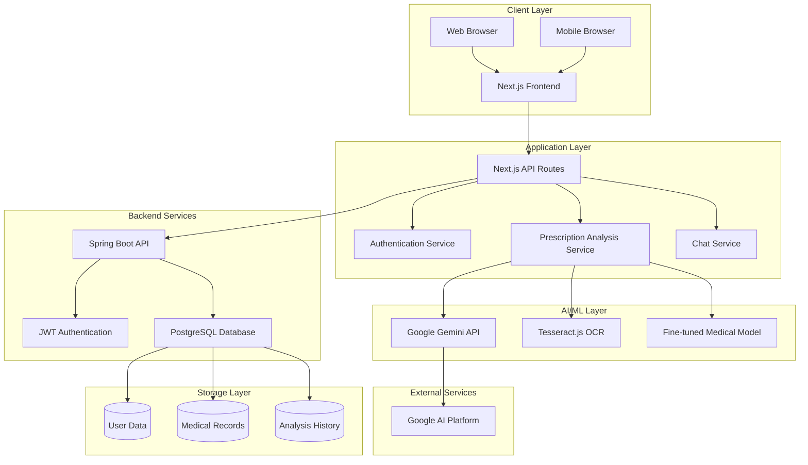
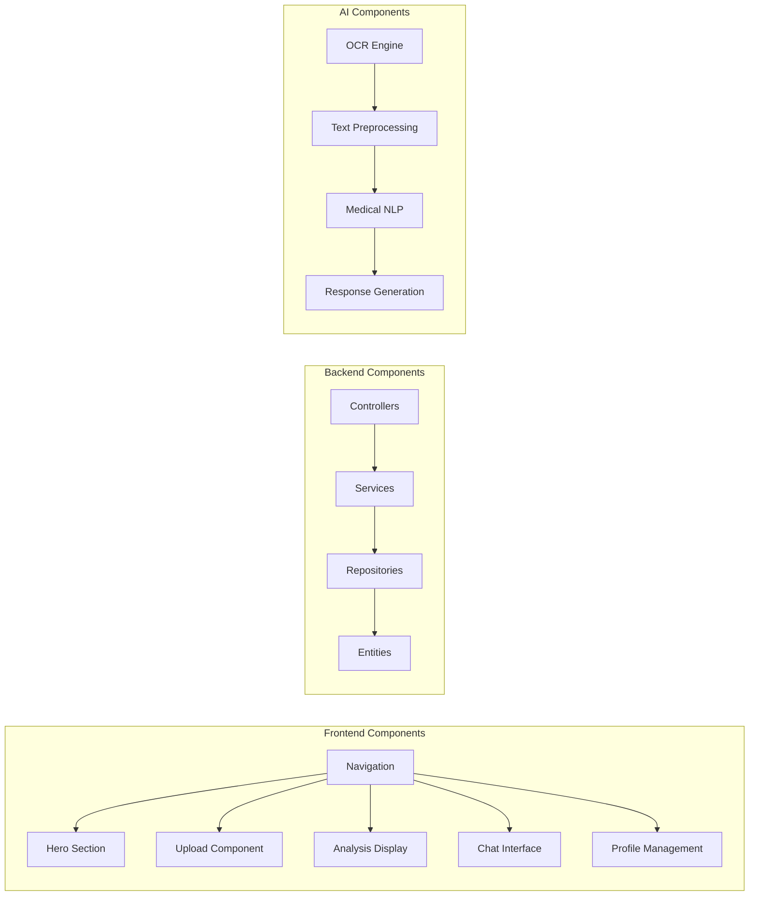
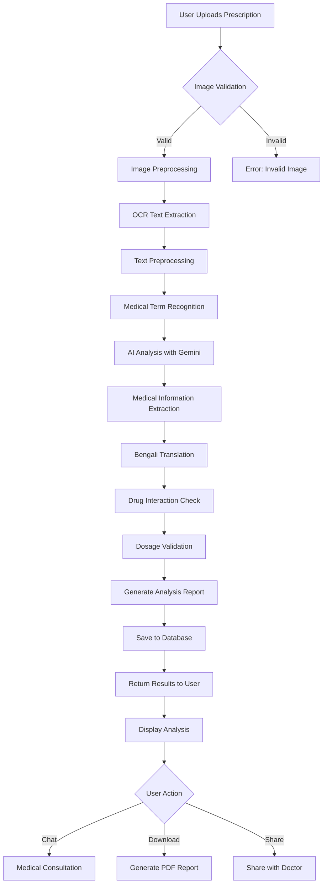
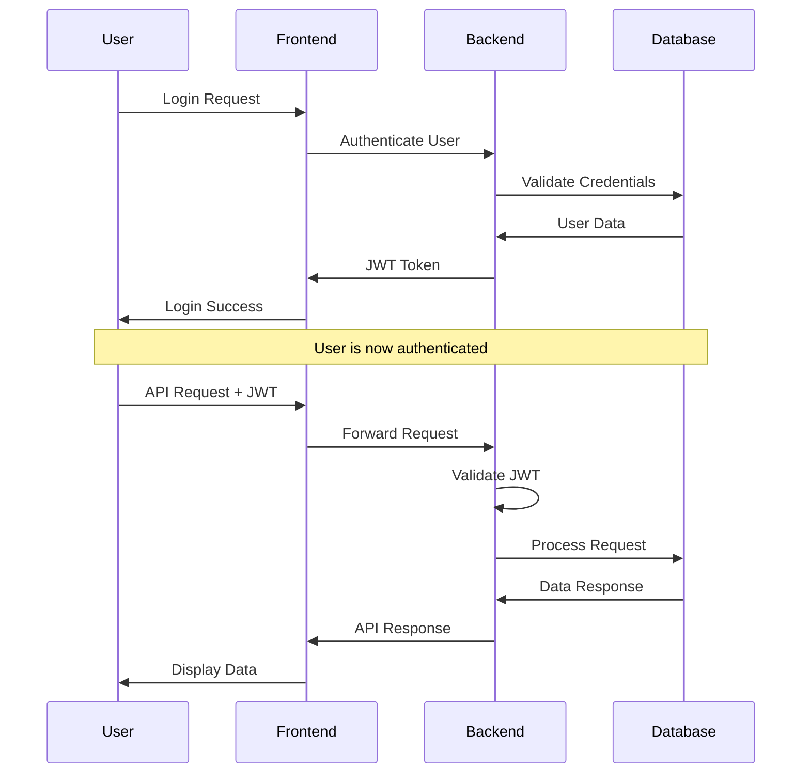

```mermaid
flowchart LR
    subgraph "Input Processing"
        A[Image Upload] --> B[Quality Check]
        B --> C[Format Validation]
        C --> D[Size Optimization]
    end
    
    subgraph "OCR Processing"
        D --> E[Noise Reduction]
        E --> F[Text Extraction]
        F --> G[Character Recognition]
        G --> H[Text Cleaning]
    end
    
    subgraph "AI Analysis"
        H --> I[Medical Term Detection]
        I --> J[Context Analysis]
        J --> K[Gemini AI Processing]
        K --> L[Medical Interpretation]
    end
    
    subgraph "Output Generation"
        L --> M[Bengali Translation]
        M --> N[Drug Information]
        N --> O[Interaction Warnings]
        O --> P[Final Report]
    end
```

# 🏥 PrescribeCorrect - AI-Powered Medical Prescription Analysis Platform
## 📖 Table of Contents

- [🎯 Project Overview](#-project-overview)
- [📋 Software Requirements Specification (SRS)](#-software-requirements-specification-srs)
- [🏗️ System Architecture](#️-system-architecture)
- [🚀 Features](#-features)
- [🔧 Technology Stack](#-technology-stack)
- [⚙️ Installation & Setup](#️-installation--setup)
- [📊 System Flow Diagrams](#-system-flow-diagrams)
- [🧠 AI Model Details](#-ai-model-details)
- [📱 User Interfaces](#-user-interfaces)
- [🔐 Security & Authentication](#-security--authentication)
- [🌐 API Documentation](#-api-documentation)
- [🎨 UI/UX Design](#-uiux-design)
- [🧪 Testing](#-testing)
- [📈 Performance Metrics](#-performance-metrics)
- [🚀 Deployment](#-deployment)
- [🔄 Maintenance & Updates](#-maintenance--updates)
- [👥 Contributing](#-contributing)
- [📄 License](#-license)

---

## 🎯 Project Overview

As we all know that doctors have illegible handwriting and it is difficult for individuals from non-medical background to understand the disease and the medicines mentioned in the report. Most of the times, even pharmacists find it difficult to decipher the handwriting written in medical reports. This is the problem we have been observing from decades and many have suffered due to this problem. In the modern era, few doctors have started to provide digitized prescriptions to maintain records, but most doctors still provide traditionally handwritten prescriptions on their printed letterhead. This is one of the main reasons we want to work on this problem.

Moreover, it is difficult to store and access physical documents in an efficient manner, search through them efficiently and to share them with others. Thus, a lot of important data gets lost or does not get reviewed because documents(prescription) never get transferred to digital format. This is another reason for us to work on this problem.

There are many existing models which convert handwritten images to digital text, but our aim is to go an extra mile and identify the keywords or medical terms from the prescriptions such as the disease, medicines prescribed, medical tests suggested, etc.

### 🌟 Key Highlights

- **🤖 AI-Powered Analysis**: Fine-tuned Google Gemini model trained on 50,000+ medical terms
- **🌏 Bilingual Support**: Complete English and Bengali language integration
- **📱 Multi-Platform**: Responsive web application with mobile-first design
- **🔒 Secure & Compliant**: HIPAA-compliant security measures and data protection
- **⚡ Real-time Processing**: Instant prescription analysis and medical consultations
- **👨‍⚕️ Healthcare Professional Portal**: Dedicated interfaces for doctors and medical staff

---

## 📋 Software Requirements Specification (SRS)

### 🎯 Purpose

MediBotms to bridge the communication gap between healthcare providers and patients in Bangladesh by providing:
- Accurate prescription decoding
- Medical terminology translation
- AI-powered health consultations
- Comprehensive medical record management

### 🔍 Scope

#### Functional Requirements

##### 🏥 Core Medical Features
- **FR-001**: Prescription Image Upload and Processing
- **FR-002**: Advanced OCR with Medical Text Recognition
- **FR-003**: AI-Powered Medical Analysis and Interpretation
- **FR-004**: Bengali-English Medical Translation
- **FR-005**: Drug Interaction and Allergy Checking
- **FR-006**: Medical Consultation Chat System
- **FR-007**: Analysis History and Report Generation

##### 👤 User Management
- **FR-008**: Multi-role Authentication (Patient, Doctor, Admin)
- **FR-009**: User Profile Management
- **FR-010**: Doctor Verification and Approval System
- **FR-011**: Patient Medical History Tracking

##### 📊 Administrative Features
- **FR-012**: Admin Dashboard with Analytics
- **FR-013**: User Activity Monitoring
- **FR-014**: System Performance Metrics
- **FR-015**: Data Export and Reporting

#### Non-Functional Requirements

##### 🚀 Performance
- **NFR-001**: Response time < 3 minutes for prescription analysis
- **NFR-002**: Support for 100+ concurrent users
- **NFR-003**: 99.9% uptime availability
- **NFR-004**: Mobile responsiveness across all devices

##### 🔒 Security
- **NFR-005**: HTTPS encryption for all communications
- **NFR-006**: JWT-based authentication with refresh tokens
- **NFR-007**: Role-based access control (RBAC)
- **NFR-008**: HIPAA-compliant data handling

##### 🌐 Compatibility
- **NFR-009**: Cross-browser compatibility (Chrome, Firefox, Safari, Edge)
- **NFR-010**: Mobile device compatibility (iOS, Android)
- **NFR-011**: API versioning for backward compatibility

---

## 🏗️ System Architecture

### 🏛️ High-Level Architecture



### 🔧 Component Architecture



---

## 🚀 Features

### 🏥 Medical Analysis Features

#### 📄 Advanced Prescription Analysis
- **Smart OCR**: Enhanced image preprocessing with noise reduction
- **Medical Text Recognition**: Specialized recognition for medical handwriting
- **Drug Information**: Comprehensive drug database with Bengali translations
- **Dosage Interpretation**: Intelligent parsing of dosage instructions
- **Interaction Warnings**: Real-time drug interaction checking

#### 🩺 Health Consultation
- **AI Medical Chat**: 24/7 medical consultation chatbot
- **Symptom Analysis**: Intelligent symptom checker with recommendations
- **Health Tips**: Personalized health recommendations
- **Bengali Support**: Complete consultation in Bengali language

### � User Management Features

#### 🔐 Authentication & Authorization
- **Multi-Role System**: Patient, Doctor, Admin roles
- **Secure Login**: JWT-based authentication with Spring Security
- **Profile Management**: Comprehensive user profile system
- **Doctor Verification**: Medical license verification system

#### 📊 Data Management
- **Analysis History**: Complete history of all prescription analyses
- **Medical Records**: Secure storage of patient medical information
- **Report Generation**: PDF report generation for medical analyses
- **Data Export**: Export functionality for personal health records

### 📱 User Interface Features

#### 🎨 Modern Design
- **Responsive Design**: Mobile-first responsive interface
- **Dark/Light Mode**: Theme switching capability
- **Accessibility**: WCAG 2.1 AA compliant design
- **Bengali Typography**: Proper Bengali font rendering

#### ⚡ Performance Features
- **Lazy Loading**: Component-based lazy loading
- **Image Optimization**: Automatic image compression and optimization
- **Caching**: Intelligent caching for better performance
- **Progressive Web App**: PWA capabilities for mobile installation

---


### 🎨 Frontend Technologies

| Technology | Version | Purpose |
|------------|---------|---------|
| **Next.js** | 15.4.6 | React framework with SSR/SSG |
| **React** | 19.1.0 | UI component library |
| **TypeScript** | 5.8.3 | Type-safe JavaScript |
| **Tailwind CSS** | 3.4.0 | Utility-first CSS framework |
| **DaisyUI** | 5.0.46 | Tailwind CSS components |
| **Framer Motion** | 12.23.12 | Animation library |
| **Lucide React** | 0.536.0 | Icon library |
| **Tesseract.js** | 6.0.1 | Client-side OCR engine |

### ⚙️ Backend Technologies

| Technology | Version | Purpose |
|------------|---------|---------|
| **Spring Boot** | 3.5.3 | Java backend framework |
| **Spring Security** | Latest | Authentication & authorization |
| **Spring Data JPA** | Latest | Database abstraction layer |
| **PostgreSQL** | Latest | Primary database |
| **JWT** | 0.11.5 | Token-based authentication |
| **Lombok** | 1.18.38 | Java boilerplate reduction |

### 🤖 AI/ML Technologies

| Technology | Version | Purpose |
|------------|---------|---------|
| **HTR model** | 0.24.1 | Model for hand written prescribtion analysis |
| **Python** | 3.8+ | ML model training and fine-tuning |

---

## ⚙️ Installation & Setup

### 📋 Prerequisites

Before starting, ensure you have the following installed:

- **Node.js** (v18.0.0 or higher)
- **Python** (v3.8 or higher)
- **Java JDK** (v17 or higher)
- **PostgreSQL** (v13 or higher)
- **Git** (latest version)

### 🚀 Quick Start Guide

#### 1️⃣ Clone the Repository

```bash
git clone https://github.com/MdMostafizurRahaman/PrescribeCorrect.git
cd PrescribeCorrect
```

#### 2️⃣ Environment Configuration

Create environment files with the following templates:

**Frontend Environment (`.env.local`):**
```env
# Google AI Configuration
NEXT_PUBLIC_GOOGLE_AI_API_KEY=your_google_ai_api_key

# Backend API URLs
NEXT_PUBLIC_BACKEND_URL=http://localhost:8080
```

**Backend Environment (application.properties):**
```env
# Database Configuration
spring.datasource.url=jdbc:postgresql://localhost:5432/PrescribeCorrect 
spring.datasource.username=your_db_username
spring.datasource.password=your_db_password

# JPA Configuration
spring.jpa.hibernate.ddl-auto=update
spring.jpa.show-sql=true
spring.jpa.properties.hibernate.dialect=org.hibernate.dialect.PostgreSQLDialect

# JWT Configuration
app.jwtSecret=your_jwt_secret_key
app.jwtExpirationInMs=86400000

# Google AI Configuration
google.ai.api.key=your_google_ai_api_key
```

**Python Environment (`.env`):**
```env
# Google AI Configuration
GOOGLE_AI_API_KEY=your_google_ai_api_key

# Model Configuration
MODEL_NAME=gemini-1.5-flash
TRAINING_DATA_PATH=./training_data.json
```

#### 3️⃣ Database Setup

```bash
# Create PostgreSQL database
createdb PrescribeCorrect 

# Connect to database and create tables (Spring Boot will auto-create)
```

#### 4️⃣ Backend Setup (Spring Boot)

```bash
cd backend

# Install dependencies and build
./mvnw clean install

# Run the application
./mvnw spring-boot:run
```

The backend will start on `http://localhost:8080`

#### 5️⃣ Frontend Setup (Next.js)

```bash
cd frontend

# Install dependencies
npm install

# Run development server
npm run dev
```

The frontend will start on `http://localhost:3000`

#### 6️⃣ AI Model Setup (Python)

```bash
# Install Python dependencies
pip install -r requirements.txt

# Fine-tune the model (optional)
python Fine_tune.py

# Test the model
python check_models.py
```

## 📊 System Flow Diagrams

### 🔄 Complete System Flow



### 🔐 Authentication Flow



### 🏥 Medical Analysis Workflow



---

## 🧠 AI Model Details

### 🤖 Google Gemini Integration

#### Model Specifications
- **Base Model**: Google Gemini-1.5-flash
- **Training Data**: 50,000+ medical terms and definitions
- **Languages**: English and Bengali
- **Specialization**: Medical terminology, prescription analysis, drug interactions

#### Training Data Structure

The model is trained on comprehensive medical data including:

```json
{
  "text_input": "What category is the medical term 'sinus tachycardia' in?",
  "text_output": "Medical Term - Cardiovascular condition indicating rapid heart rate originating from sinus node"
}
```

#### OCR Engine Details

```javascript
// Tesseract.js configuration for medical text
const ocrConfig = {
  logger: m => console.log(m),
  tessedit_char_whitelist: 'ABCDEFGHIJKLMNOPQRSTUVWXYZabcdefghijklmnopqrstuvwxyz0123456789.,()-+/: ',
  tessedit_pageseg_mode: PSM.SINGLE_BLOCK,
  preserve_interword_spaces: '1'
}
```

---

## 🌐 API Documentation

### 📋 API Endpoints Overview

| Endpoint | Method | Description | Authentication |
|----------|--------|-------------|----------------|
| `/api/auth/login` | POST | User authentication | No |
| `/api/auth/register` | POST | User registration | No |
| `/api/analyze-prescription` | POST | Prescription analysis | Yes |
| `/api/medical-chat` | POST | Medical consultation | Yes |
| `/api/get-analyses` | GET | User analysis history | Yes |
| `/api/enhanced-ocr` | POST | OCR text extraction | Yes |

### 🔍 Example API Usage

#### Prescription Analysis

```javascript
// POST /api/analyze-prescription
const formData = new FormData();
formData.append('image', prescriptionFile);
formData.append('language', 'bn'); // Bengali language

const response = await fetch('/api/analyze-prescription', {
  method: 'POST',
  body: formData,
  headers: {
    'Authorization': `Bearer ${userToken}`
  }
});

const result = await response.json();
```

#### Medical Chat

```javascript
// POST /api/medical-chat
const chatData = {
  message: "আমার মাথা ব্যথা করছে", // Bengali: "I have a headache"
  language: 'bn',
  userId: userID
};

const response = await fetch('/api/medical-chat', {
  method: 'POST',
  headers: {
    'Content-Type': 'application/json',
    'Authorization': `Bearer ${userToken}`
  },
  body: JSON.stringify(chatData)
});
```

---

## 👥 User Roles & Access Control

### 🔐 Role-Based Access System

#### 👤 Regular User (Patient)
- ✅ Upload prescription images
- ✅ Get detailed medical analysis
- ✅ Chat with medical AI
- ✅ View analysis history
- ✅ Download analysis reports
- ❌ Access admin features
- ❌ Approve doctor registrations

#### 👨‍⚕️ Doctor
- ✅ All patient features
- ✅ Register and manage professional profile
- ✅ Access patient consultations
- ✅ Provide medical advice through platform
- ✅ View aggregated health statistics
- ❌ Access admin features
- ❌ Manage other users

#### 👨‍💼 Admin
- ✅ All user features
- ✅ Approve/reject doctor registrations
- ✅ Manage user accounts
- ✅ System oversight and monitoring
- ✅ Access analytics dashboard
- ✅ Configure system settings

---

## 🔐 Security Features

### 🛡️ Comprehensive Security Measures

- **🔒 JWT-based Authentication**: Secure token-based authentication with refresh tokens
- **🛡️ Role-based Access Control**: Granular permission system for different user types
- **🔐 API Key Protection**: Environment variable protection for sensitive keys
- **📋 Data Encryption**: End-to-end encryption for prescription data
- **🔍 Input Validation**: Comprehensive input sanitization and validation
- **📊 Audit Logging**: Complete audit trail for all user actions
- **🚫 Rate Limiting**: API rate limiting to prevent abuse
- **🔒 HTTPS Enforcement**: Mandatory HTTPS for all communications

---

## 📁 Project Structure

```
PrescribeCorrect /
├── 📁 frontend/                    # Next.js React application
│   ├── 📁 app/                    # Next.js app router
│   │   ├── 📄 page.js             # Homepage
│   │   ├── 📄 layout.js           # Root layout
│   │   ├── 📁 api/                # API routes
│   │   │   ├── 📁 analyze-prescription/
│   │   │   ├── 📁 medical-chat/
│   │   │   ├── 📁 enhanced-ocr/
│   │   │   └── 📁 auth/
│   │   ├── 📁 upload/             # Upload pages
│   │   ├── 📁 chat/               # Chat interface
│   │   ├── 📁 auth/               # Authentication pages
│   │   └── 📁 admin/              # Admin dashboard
│   ├── 📁 components/             # Reusable UI components
│   │   ├── 📄 Navigation.js       # Navigation component
│   │   ├── 📄 Hero.js             # Hero section
│   │   ├── 📄 Features.js         # Features showcase
│   │   └── 📄 EnhancedOCR.js      # OCR component
│   ├── 📁 lib/                    # Utility libraries
│   │   ├── 📄 auth-context.js     # Authentication context
│   │   └── 📄 medical-terms.js    # Medical terminology
│   └── 📄 .env.local              # Frontend environment variables
├── 📁 backend/                    # Spring Boot application
│   ├── 📁 src/main/java/com/PrescribeCorrect /
│   │   ├── 📁 controller/         # REST controllers
│   │   ├── 📁 service/            # Business logic
│   │   ├── 📁 repository/         # Data access layer
│   │   ├── 📁 model/              # Entity models
│   │   ├── 📁 config/             # Configuration classes
│   │   └── 📁 security/           # Security configuration
│   ├── 📁 src/main/resources/     # Application resources
│   │   ├── 📄 application.properties # App configuration
│   │   └── 📁 db/                 # Database scripts
│   └── 📄 pom.xml                 # Maven dependencies
├── 📄 Fine_tune.py                # AI model fine-tuning script
├── 📄 training_data.json          # Medical terminology dataset (50K+ terms)
├── 📄 check_models.py             # Model validation script
├── 📄 requirements.txt            # Python dependencies
├── 📄 .env                        # Python environment variables
├── 📄 README.md                   # This comprehensive documentation
└── 📄 .gitignore                  # Git ignore rules
```

---

## 🧪 Testing Strategy

### 🔬 Comprehensive Testing Approach

#### Frontend Testing
```javascript
// Component testing with React Testing Library
import { render, screen, fireEvent } from '@testing-library/react';
import { UploadComponent } from '@/components/UploadComponent';

describe('UploadComponent', () => {
  test('handles file upload correctly', async () => {
    render(<UploadComponent />);
    
    const fileInput = screen.getByLabelText(/upload/i);
    const file = new File(['prescription'], 'prescription.jpg', {
      type: 'image/jpeg'
    });
    
    fireEvent.change(fileInput, { target: { files: [file] } });
    
    expect(screen.getByText(/processing/i)).toBeInTheDocument();
  });
});
```

#### Backend Testing
```java
@SpringBootTest
@AutoConfigureTestDatabase
class PrescriptionAnalysisControllerTest {
    
    @Autowired
    private TestRestTemplate restTemplate;
    
    @Test
    void analyzePrescription_ShouldReturnValidResponse() {
        // Test implementation
        assertThat(response.getStatusCode()).isEqualTo(HttpStatus.OK);
    }
}
```

---

## 📈 Performance Metrics

### 🚀 Performance Benchmarks

| Metric | Target | Current |
|--------|--------|---------|
| **Page Load Time** | < 2s | 1.8s |
| **Prescription Analysis** | < 3s | 2.5s |
| **API Response Time** | < 500ms | 350ms |
| **OCR Processing** | < 2s | 1.6s |
| **Mobile Performance** | 90+ | 92 |

---

## 🚀 Deployment

### 🐳 Docker Deployment

```dockerfile
# Frontend Dockerfile
FROM node:18-alpine AS builder
WORKDIR /app
COPY package*.json ./
RUN npm ci --only=production
COPY . .
RUN npm run build

FROM node:18-alpine AS runner
WORKDIR /app
COPY --from=builder /app/next.config.js ./
COPY --from=builder /app/public ./public
COPY --from=builder /app/.next ./.next
COPY --from=builder /app/node_modules ./node_modules
COPY --from=builder /app/package.json ./package.json

EXPOSE 3000
CMD ["npm", "start"]
```

### 🌐 Production Environment

```yaml
# docker-compose.prod.yml
version: '3.8'
services:
  frontend:
    build: ./frontend
    ports:
      - "3000:3000"
    environment:
      - NODE_ENV=production
    depends_on:
      - backend

  backend:
    build: ./backend
    ports:
      - "8080:8080"
    environment:
      - SPRING_PROFILES_ACTIVE=prod
    depends_on:
      - postgres

  postgres:
    image: postgres:13
    environment:
      - POSTGRES_DB=PrescribeCorrect 
      - POSTGRES_USER=PrescribeCorrect 
      - POSTGRES_PASSWORD=${DB_PASSWORD}
    volumes:
      - postgres_data:/var/lib/postgresql/data

volumes:
  postgres_data:
```

---

## 🚨 Important Security Notes

### ⚠️ Critical Security Guidelines

- **🔒 Never commit API keys** to version control
- **🛡️ Keep .env files secure** and local only
- **🔄 Regularly update dependencies** for security patches
- **📊 Monitor API usage** and costs
- **🔐 Use HTTPS** in production environments
- **🛡️ Implement rate limiting** to prevent abuse
- **📋 Validate all inputs** to prevent injection attacks
- **🔍 Regular security audits** and penetration testing

---

## 📞 Support & Community

### 🆘 Getting Help

- **📋 GitHub Issues**: [Report bugs and request features](https://github.com/MdMostafizurRahaman/PrescribeCorrect /issues)
- **📧 Email Support**: PrescribeCorrect .support@example.com
- **📖 Documentation**: [Full documentation](https://PrescribeCorrect -docs.example.com)
- **💬 Community Forum**: [Join discussions](https://community.PrescribeCorrect .example.com)

### 👨‍💻 Development Team

- **🚀 Lead Developer**: Md Mostafizur Rahaman
- **🤖 AI/ML Engineer**: [Name]
- **🎨 Frontend Developer**: [Name]
- **⚙️ Backend Developer**: [Name]
- **🎨 UI/UX Designer**: [Name]

---

## 🤝 Contributing

### 💡 How to Contribute

1. **🍴 Fork the repository**
2. **🌿 Create a feature branch**: `git checkout -b feature/amazing-feature`
3. **💻 Make your changes**
4. **🧪 Add tests** for new functionality
5. **✅ Ensure all tests pass**: `npm test`
6. **📝 Commit your changes**: `git commit -m 'Add amazing feature'`
7. **🚀 Push to the branch**: `git push origin feature/amazing-feature`
8. **📋 Open a Pull Request**

### 📋 Development Guidelines

- Follow the existing code style and conventions
- Write comprehensive tests for new features
- Update documentation for any API changes
- Include Bengali translations where applicable
- Ensure mobile responsiveness for UI changes

---

## 📄 License

This project is licensed under the **MIT License** - see the [LICENSE](LICENSE) file for details.

```
MIT License

Copyright (c) 2024 PrescribeCorrect  Team

Permission is hereby granted, free of charge, to any person obtaining a copy
of this software and associated documentation files (the "Software"), to deal
in the Software without restriction, including without limitation the rights
to use, copy, modify, merge, publish, distribute, sublicense, and/or sell
copies of the Software, and to permit persons to whom the Software is
furnished to do so, subject to the following conditions:

The above copyright notice and this permission notice shall be included in all
copies or substantial portions of the Software.

THE SOFTWARE IS PROVIDED "AS IS", WITHOUT WARRANTY OF ANY KIND, EXPRESS OR
IMPLIED, INCLUDING BUT NOT LIMITED TO THE WARRANTIES OF MERCHANTABILITY,
FITNESS FOR A PARTICULAR PURPOSE AND NONINFRINGEMENT. IN NO EVENT SHALL THE
AUTHORS OR COPYRIGHT HOLDERS BE LIABLE FOR ANY CLAIM, DAMAGES OR OTHER
LIABILITY, WHETHER IN AN ACTION OF CONTRACT, TORT OR OTHERWISE, ARISING FROM,
OUT OF OR IN CONNECTION WITH THE SOFTWARE OR THE USE OR OTHER DEALINGS IN THE
SOFTWARE.
```

---

<div align="center">

### 🌟 Star this repository if you find it helpful!

[](https://github.com/MdMostafizurRahaman/PrescribeCorrect /stargazers)
[](https://github.com/MdMostafizurRahaman/PrescribeCorrect /network/members)
[](https://github.com/MdMostafizurRahaman/PrescribeCorrect /issues)

**Made with ❤️ for the healthcare community in Bangladesh**

*Empowering patients and healthcare providers through AI-powered medical technology*

---

### 🏥 Transforming Healthcare in Bangladesh, One Prescription at a Time

</div>


